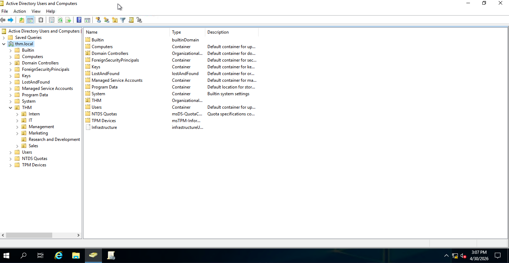
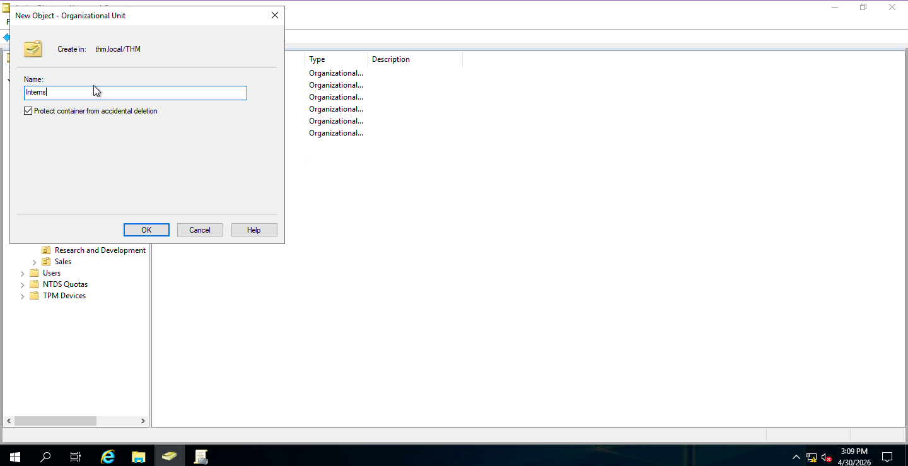
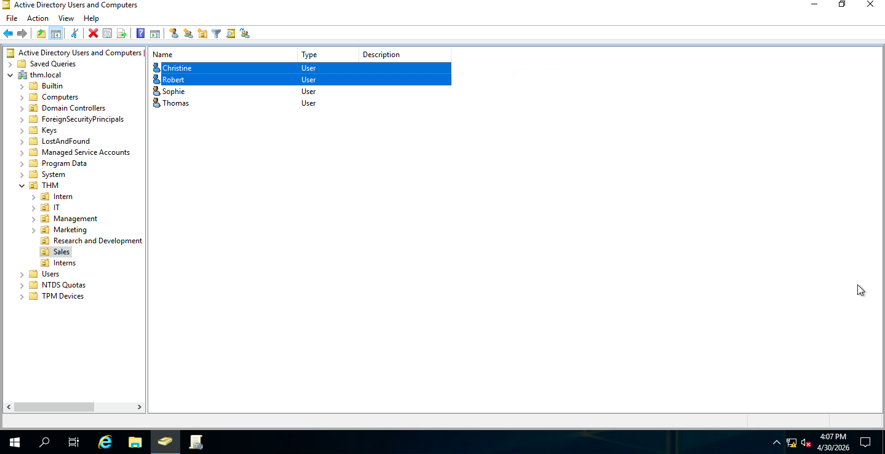
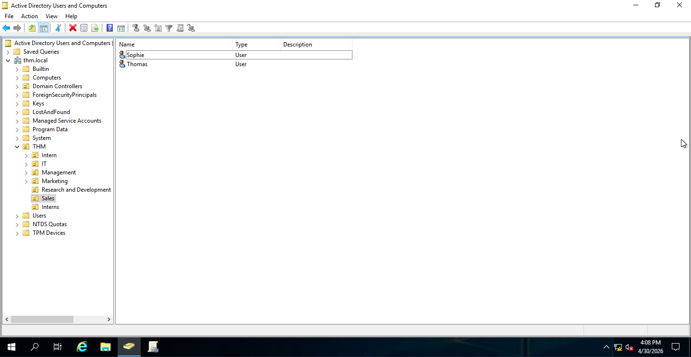
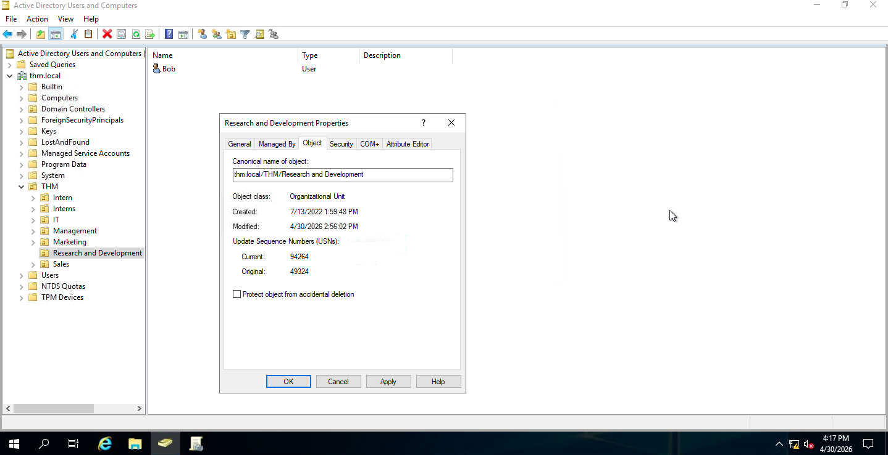
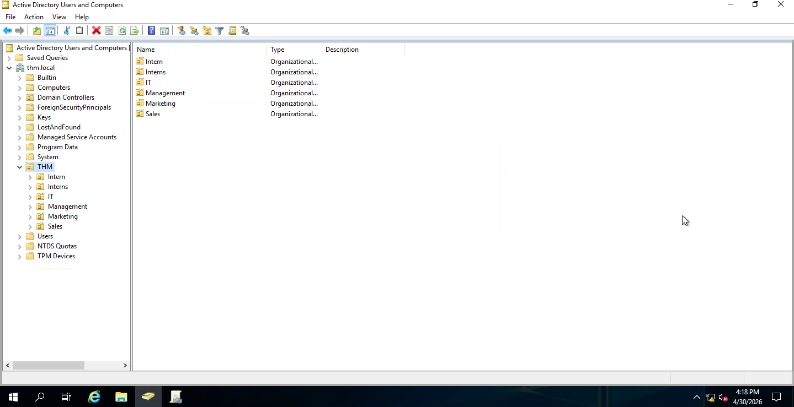

# Active Directory IT Support Project

## Overview
This project demonstrates foundational Active Directory skills used in IT support roles. It focuses on user account management, group-based access control, and troubleshooting common issues in a Windows environment.

This project reinforces prior experience supporting users and systems by applying Active Directory concepts in a hands-on lab environment.

---

## Tools & Environment
- Windows Virtual Machine
- Active Directory concepts
- Command Prompt
- TryHackMe platform

## Active Directory Console

---
## Organizational Unit (OU) Management
### Scenario: Creating an OU for interns
- created a new organizational unit (OU) to organize user accounts
- demonstrated how OUs help structure domain environments

### Scenario: Cleaningup users in OU
- Reviewed user accounts within the Sales Organizational unit
- Identified unnecessary or inactive users
- Removed two users to maintain proper accesss control

**Before Cleanup:**

**After Cleanup**

### Scenario: Remooving Deprecated Department (R&D OU)
-Identified an outdated organizational unit following company restructuring
-Removed the Research and Development OU you to maintain an accurate directory structure
-Ensured the environment reflects current business operations

**Before Deletion**

**After Deletion**

## User Account Management
### Scenario: Password Reset
- Simulated resetting a user password
- Ensured user could log back into the system

### Scenario: Account Lockout
- Identified locked account
- Unlocked user account to restore access

---

## Group Management
### Scenario: Access to Shared Resources
- Assigned users to appropriate groups
- Demonstrated how group membership controls access

---

## Computer (Machine) Management
### Scenario: Domain-Joined Systems
- Identified machine accounts (e.g., PC01, DC01$)
- Understood how computers are managed within a domain

---

## Troubleshooting Scenarios
- User unable to log in
- Account locked out
- Access denied to shared resources

---

## Key Takeaways
- Active Directory is used to manage users, computers, and permissions
- Group-based access control simplifies permission management
- IT support relies heavily on AD for troubleshooting login and access issues

---

## Screenshots
(Add your lab screenshots here)
