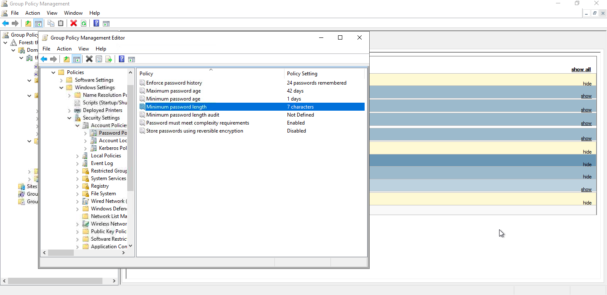
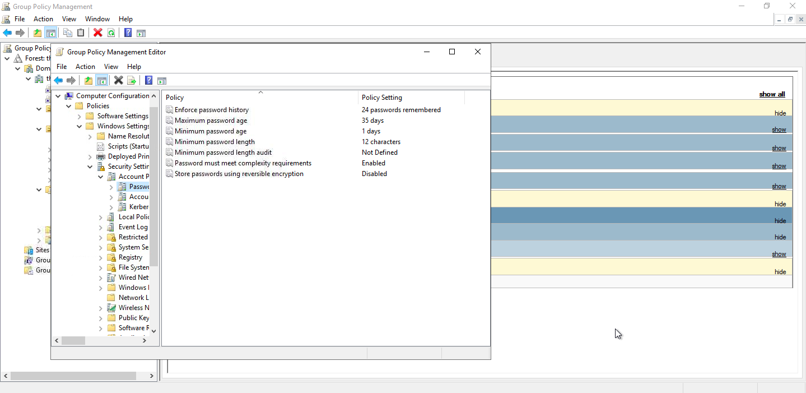
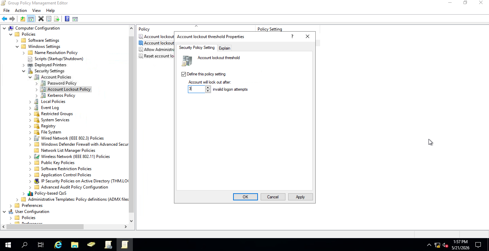
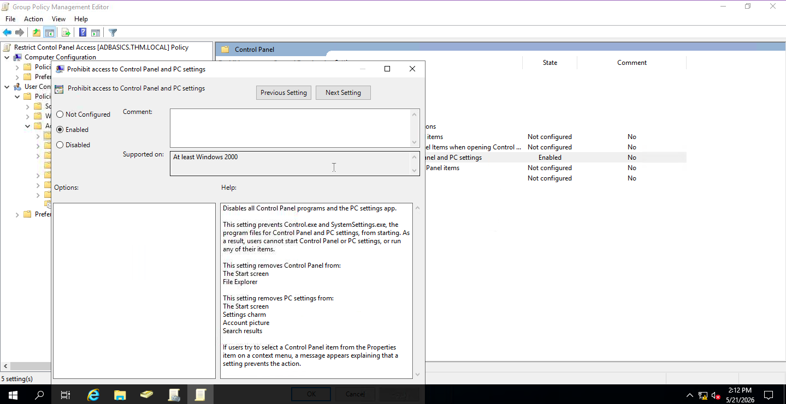
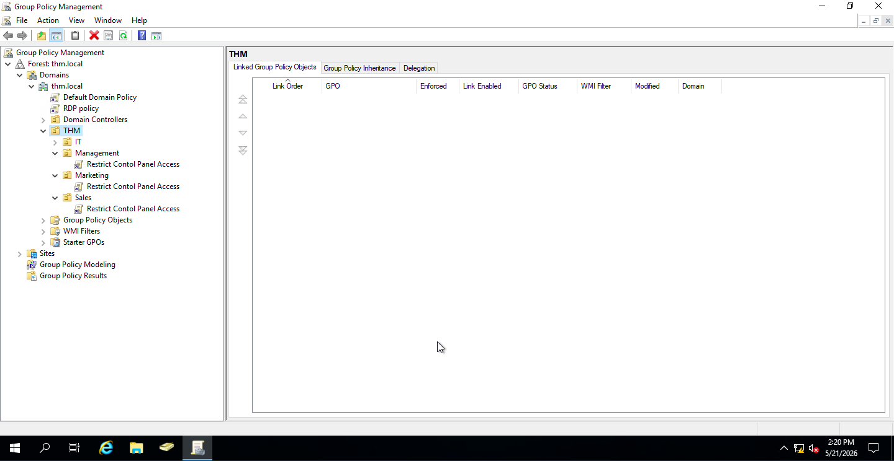

# Active Directory IT Support Project

## Active Directory Console

  
## Overview
This project demonstrates foundational Active Directory skills used in IT support roles. It focuses on user account management, group-based access control, and troubleshooting common issues in a Windows environment.

This project reinforces prior experience supporting users and systems by applying Active Directory concepts in a hands-on lab environment.

## Skills Demonstrated
- Active Directory Administration
- Group Policy Management
- User & Computer Account Management
- Access Control & Delegation
- Password & Account Security
- Windows Administration

---

## Tools & Environment
- Windows Virtual Machine
- Active Directory concepts
- Command Prompt
- TryHackMe platform

---
## Organizational Unit (OU) Management
### Scenario: Creating an OU for interns
- created a new organizational unit (OU) to organize user accounts
- demonstrated how OUs help structure domain environments

### Scenario: Cleaningup users in OU
- Reviewed user accounts within the Sales Organizational unit
- Identified unnecessary or inactive users
- Removed two users to maintain proper accesss control

**Before Cleanup:**

**After Cleanup**

### Scenario: Remooving Deprecated Department (R&D OU)
-Identified an outdated organizational unit following company restructuring
-Removed the Research and Development OU you to maintain an accurate directory structure
-Ensured the environment reflects current business operations

**Before Deletion**

**After Deletion**

## User Account Management

### 🔐 Scenario: Delegating Password Reset Permissions
- Assigned delegated permissions to user **Philip** to reset passwords
- Used the **Delegation of Control Wizard** in Active Directory
- Selected specific task: *Reset user passwords and force password change at next logon*

#### Delegation Setup
**Delegation - Select User**

**Delegation - Assign Permissions**

### 🔑 Scenario: Password Reset & Enforcement
- Reset user **Sophie’s** password using delegated account (**Philip**)
- Forced password change at next login for security compliance
- Verified system prompt requiring password update

#### Password Reset Execution
**Password Reset Command**

**Force Password Change Command**

**Password Change Prompt**

### Scenario: Account Lockout
- Simulated multiple failed login attempts
- Triggered account lockout based on Group Policy settings
- Observed system lockout message during login attempt

**Account Lockout Evidence:**

### 🔓 Scenario: Account Unlock
- Identified locked user account in Active Directory Users and Computers (ADUC)
- Unlocked account via user properties
- Restored access successfully

****Account Lockout Evidence**

**Account Unlocked**

## Group Management
### Scenario: Access to Shared Resources
- Configured password policy settings using Group Policy
- Reduced maximum password age from 42 to 35 days
- Increased minimum password length to 12 characters
- Enforced password complexity requirements
- Maintained password history settings to prevent password reuse

#### Password Policy Before Changes

#### Password Policy After Changes

### 🔒 Scenario: Account Lockout Policy

- Configured Group Policy settings to lock user accounts after multiple failed login attempts
- Applied lockout threshold, lockout duration, and reset counter policies
- Verified policy enforcement through successful account lockout behavior during login attempts

#### Account Lockout Policy Configuration

#### Account Lockout Triggered

### 🛡️ Scenario: Restricting Control Panel Access
- Created and configured a dedicated Group Policy Object (GPO) to restrict Control Panel access
- Applied the policy to departmental Organizational Units (OUs)
- Prevented non-IT users from modifying workstation settings through centralized policy enforcement

#### Policy Configuration

#### GPO Linked to Organizational Units

### ⏱️ Scenario: Automatic Screen Lock After Inactivity
- Created and configured a Group Policy Object (GPO) to automatically lock inactive sessions
- Applied inactivity timeout settings to improve workstation and server security
- Linked the policy to the root domain for centralized enforcement
- Reduced the risk of unattended and exposed user sessions

#### Screen Lock Policy Configuration

#### GPO Linked to Root Domain

- Assigned users to appropriate groups
- Demonstrated how group membership controls access

---

## Computer (Machine) Management
### 🖥️ Scenario: Viewing Domain Computers
- Disabled a computer account in Active Directory
- Demonstrated how inactive or compromised devices can be restricted from domain access
- Re-enabled the computer account to restore authentication access
- 
#### Domain Computers in Active Directory

### 🏢 Scenario: Organizing Computer Objects
#### Moving Computer into Correct OU

### 🚫 Scenario: Disabling Inactive Computer Account
#### Disable Computer Account

## Key Takeaways
- Active Directory is used to manage users, computers, and permissions
- Group-based access control simplifies permission management
- IT support relies heavily on AD for troubleshooting login and access issues

---

