# Active Directory IT Support Project

## Overview
This project demonstrates foundational Active Directory skills used in IT support roles. It focuses on user account management, group-based access control, and troubleshooting common issues in a Windows environment.

This project reinforces prior experience supporting users and systems by applying Active Directory concepts in a hands-on lab environment.

---

## Tools & Environment
- Windows Virtual Machine
- Active Directory concepts
- Command Prompt
- TryHackMe platform

## Active Directory Console
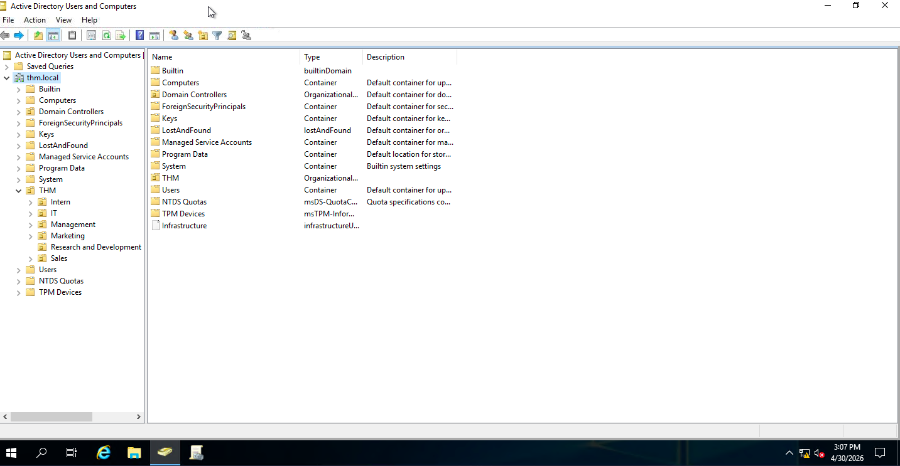

---
## Organizational Unit (OU) Management
### Scenario: Creating an OU for interns
- created a new organizational unit (OU) to organize user accounts
- demonstrated how OUs help structure domain environments
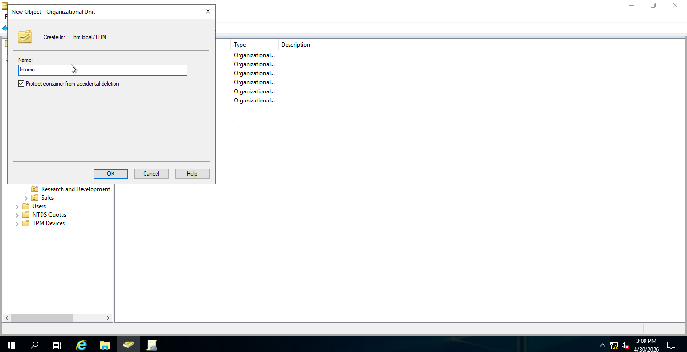

### Scenario: Cleaningup users in OU
- Reviewed user accounts within the Sales Organizational unit
- Identified unnecessary or inactive users
- Removed two users to maintain proper accesss control

**Before Cleanup:**
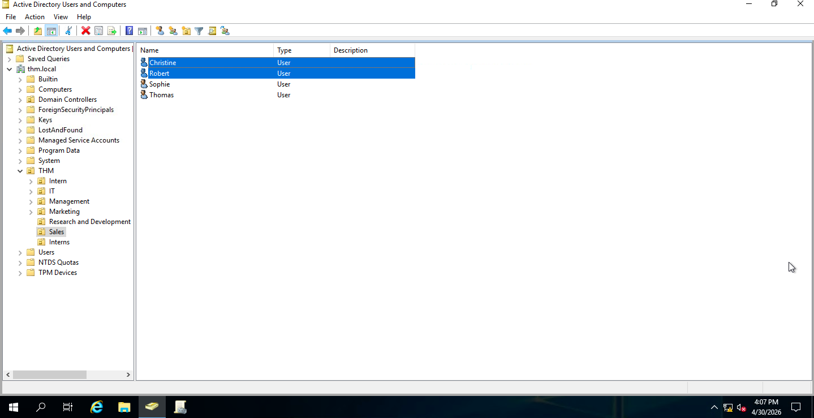

**After Cleanup**
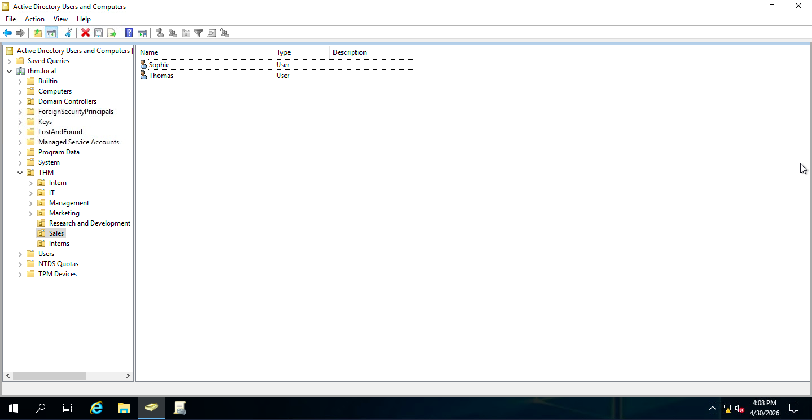

### Scenario: Remooving Deprecated Department (R&D OU)
-Identified an outdated organizational unit following company restructuring
-Removed the Research and Development OU you to maintain an accurate directory structure
-Ensured the environment reflects current business operations

**Before Deletion**
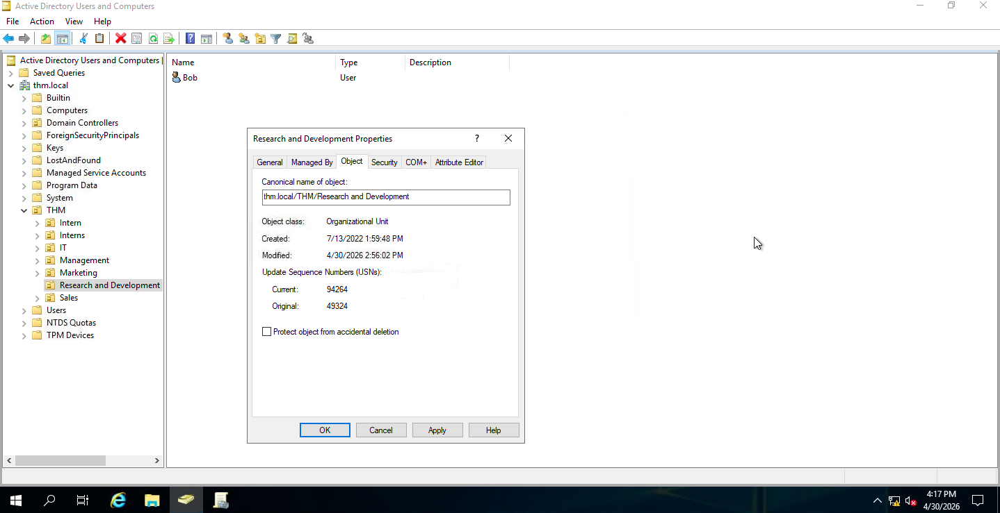

**After Deletion**
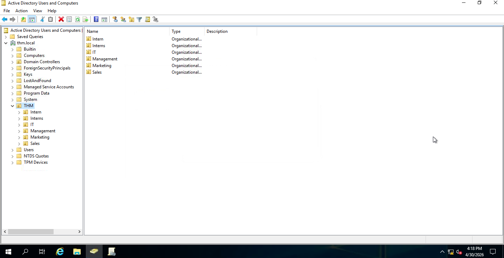

## User Account Management

### 🔐 Scenario: Delegating Password Reset Permissions
- Assigned delegated permissions to user **Philip** to reset passwords
- Used the **Delegation of Control Wizard** in Active Directory
- Selected specific task: *Reset user passwords and force password change at next logon*

#### Delegation Setup
**Delegation - Select User**
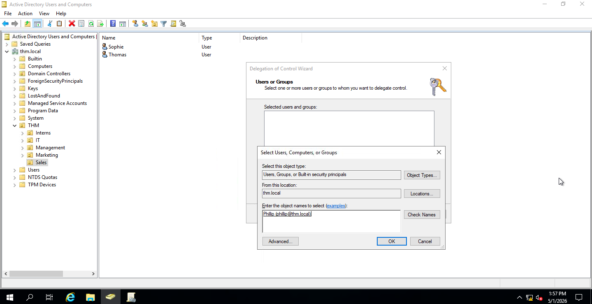
**Delegation - Assign Permissions**
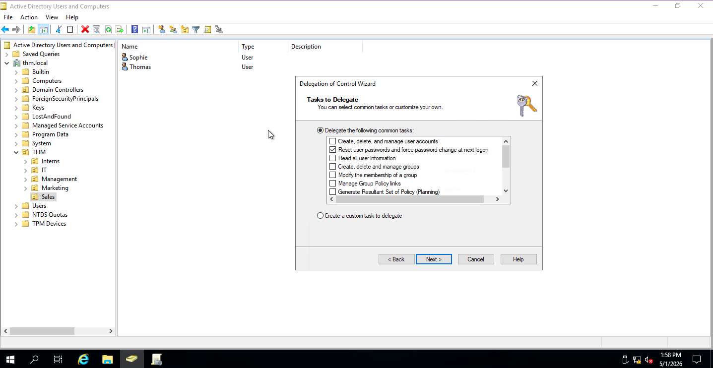

### 🔑 Scenario: Password Reset & Enforcement
- Reset user **Sophie’s** password using delegated account (**Philip**)
- Forced password change at next login for security compliance
- Verified system prompt requiring password update

#### Password Reset Execution
**Password Reset Command**
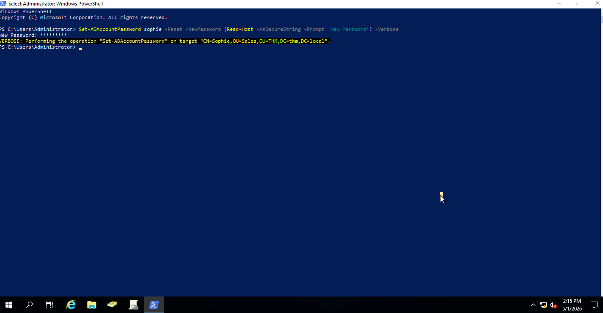
**Force Password Change Command**
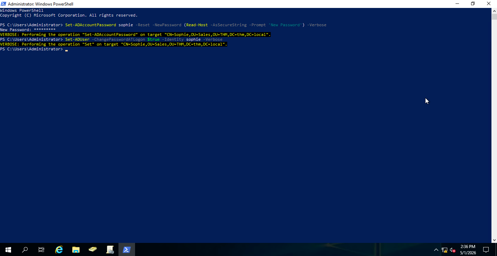
**Password Change Prompt**
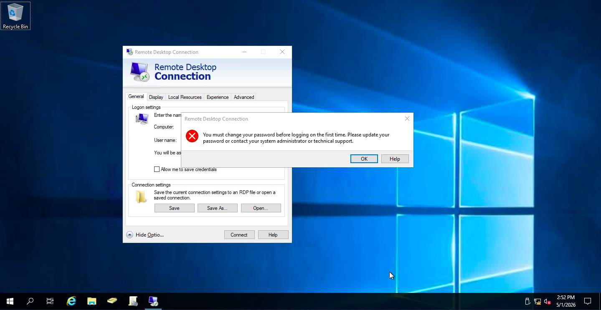

### Scenario: Account Lockout
- Simulated multiple failed login attempts
- Triggered account lockout based on Group Policy settings
- Observed system lockout message during login attempt

**Account Lockout Evidence:**
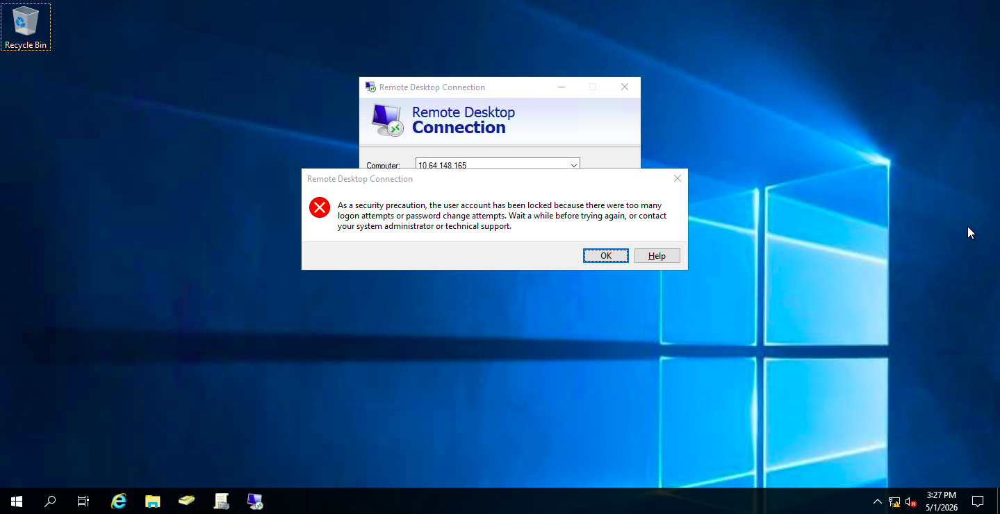

### 🔓 Scenario: Account Unlock
- Identified locked user account in Active Directory Users and Computers (ADUC)
- Unlocked account via user properties
- Restored access successfully

****Account Lockout Evidence**
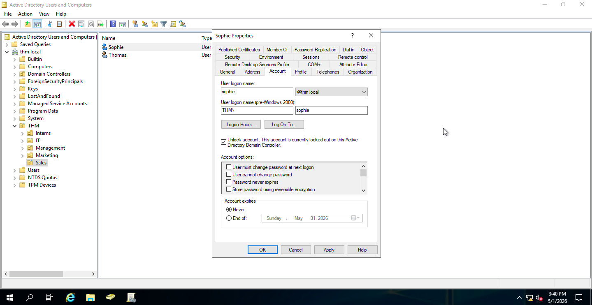
**Account Unlocked**
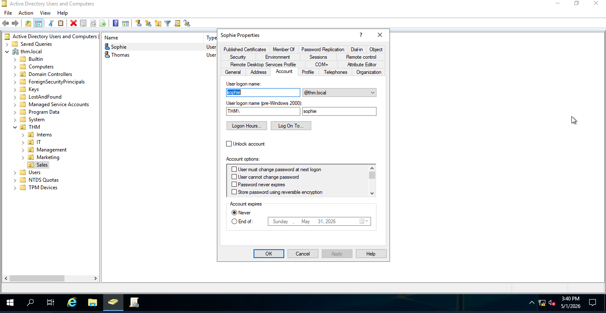

## Group Management
### Scenario: Access to Shared Resources
- Assigned users to appropriate groups
- Demonstrated how group membership controls access

---

## Computer (Machine) Management
### 🖥️ Scenario: Viewing Domain Computers
#### Domain Computers in Active Directory
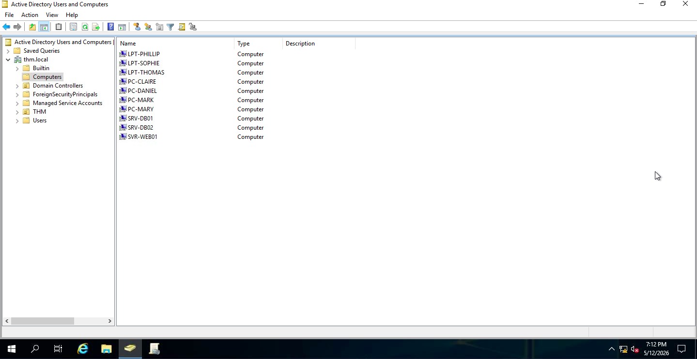

### 🏢 Scenario: Organizing Computer Objects
#### Moving Computer into Correct OU
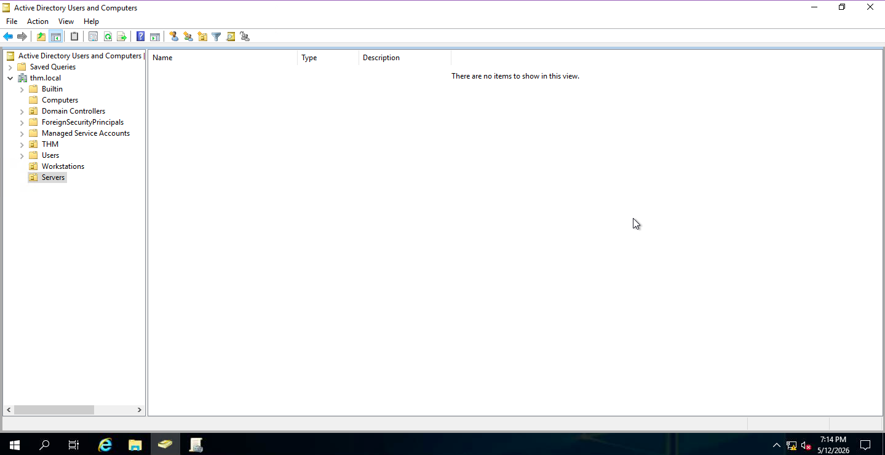

### 🚫 Scenario: Disabling Inactive Computer Account
#### Disable Computer Account
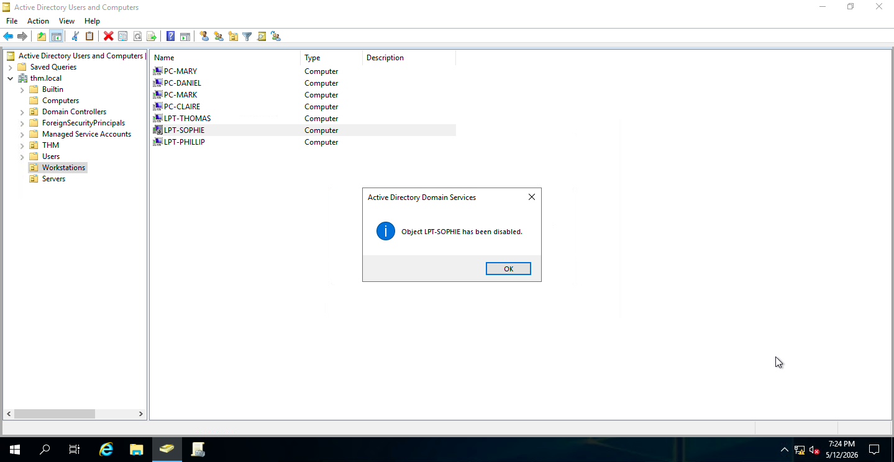

## Troubleshooting Scenarios
- User unable to log in
- Account locked out
- Access denied to shared resources

---

## Key Takeaways
- Active Directory is used to manage users, computers, and permissions
- Group-based access control simplifies permission management
- IT support relies heavily on AD for troubleshooting login and access issues

---

## Screenshots
(Add your lab screenshots here)
